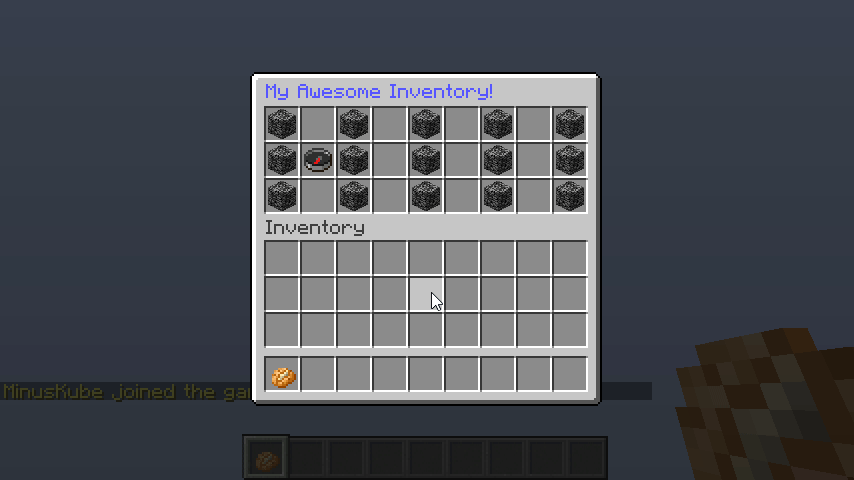

# 2. Content Provider

Now, you maybe want to know how to put items in your new inventory. To do that, you'll need to create a new InventoryProvider.

InventoryProvider is an interface, so you just need to implements it, example:

```java
public class MyProvider implements InventoryProvider {

    @Override
    public void init(Player player, InventoryContents contents) {}

    @Override
    public void update(Player player, InventoryContents contents) {}

}
```

Here, the method `init` will be called when an inventory is opened for the player, and the method `update` will be called every tick for the players with the inventory opened.

To put the items in the inventory, you just have to use the methods of the given `InventoryContents`, like `fillRow(row, item)`. Theses methods requires a `ClickableItem`, which is just an `ItemStack` combined with a `Consumer<InventoryClickEvent>`.

To create a `ClickableItem`, you just have to use `ClickableItem.of(ItemStack, Consumer<InventoryClickEvent>)`, or `Clickable.empty(ItemStack)` to create an item with an empty consumer, example:

```java
ClickableItem item = ClickableItem.of(new ItemStack(Material.POTATO_ITEM, 2), e -> {
    Bukkit.broadcastMessage(ChatColor.DARK_AQUA + "A potato has been clicked");
});
```

All the SmartInvs methods which asks for a `row` and a `column` have an overload method which asks for a `SlotPos` you can build using `SlotPos.of(row, column)`, these SlotPos are totally immutables.

This is a list of all the `InventoryContents` methods you can use to play with the inventory items:

| Method | Description |
| :--- | :--- |
| `all()` | Returns all the inventory items |
| `get(row, column)` | Returns the items at the given row and column |
| `set(row, column, item)` | Sets the item at the given row and column |
| `firstEmpty()` | Returns the first empty slot |
| `add(item)` | Adds the item to the first empty slot, if possible |
| `fill(item)` | Fills the inventory with the given item |
| `fillRow(row, item)` | Fills the given row with the given item |
| `fillColumn(column, item)` | Fills the given column with the given item |
| `fillBorders(item)` | Fills the inventory borders with the given item |
| `fillRect(fromRow, fromColumn, toRow, toColumn, item)` | Fills a rectangle made of the given boundaries with the given item |

If you need to set properties to your InventoryContents, you can use the `setProperty(String name, Object value)` method, to get the properties, use `property(String name)` or `property(String name, T def)` to provide a default value.

> Each opened inventory has a different InventoryContents, so when you create an iterator or set a property, it will only be saved for the opened inventory o the actual player.

## Example

```java
public class MyProvider implements InventoryProvider {

    @Override
    public void init(Player player, InventoryContents contents) {
        for(int i = 0; i < 9; i += 2)
            contents.fillColumn(i, ClickableItem.empty(new ItemStack(Material.BEDROCK)));

        contents.set(1, 1, ClickableItem.of(new ItemStack(Material.COMPASS), e -> {
            if(e.isLeftClick()) {
                player.sendMessage(ChatColor.GOLD + "You left clicked on my compass! "
                        + ChatColor.YELLOW + "Here is a carrot, you deserve it.");

                contents.set(1, 1, ClickableItem.empty(new ItemStack(Material.CARROT_ITEM)));
            }
            else if(e.isRightClick()) {
                player.sendMessage(ChatColor.DARK_RED + "Oh no! The right click was trapped! "
                        + ChatColor.RED + "You found a stick...");

                contents.set(1, 1, ClickableItem.empty(new ItemStack(Material.STICK)));
            }
        }));
    }


    @Override
    public void update(Player player, InventoryContents contents) {}

}
```

And this is the result of this provider, when applied to a basic chest inventory with 3 rows:



In this example, I didn't used the `update` method, but you can use it exactly like the `init` method.

